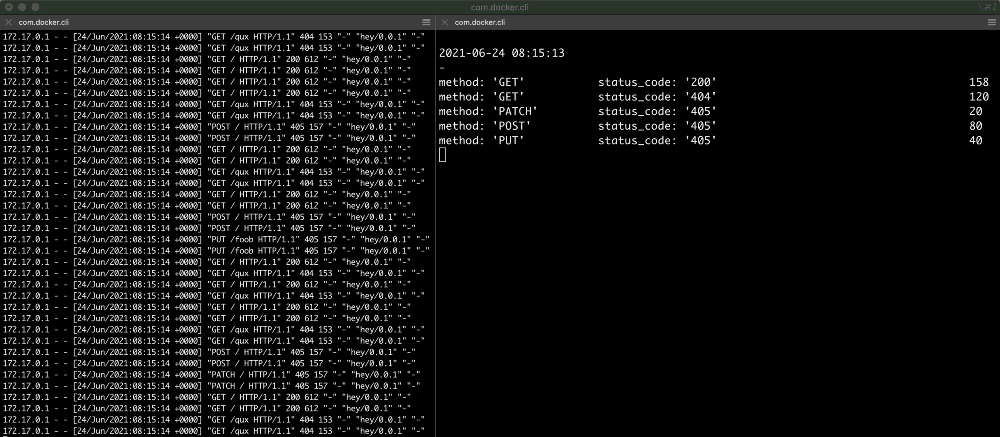
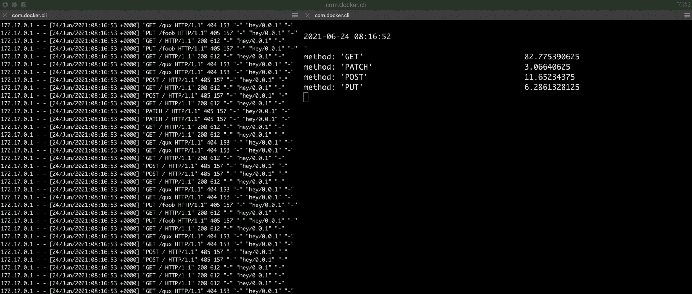

# pq - Parse and Query files with PromQL-like language

Project is actively being developed!

## Why

I often find myself staring at some Nginx or Envoy access logs `tail`ed to my screen
in real time.  My only wish at that moment is to be able to aggregate the lines
somehow and analyze the output at a slower pace using a PromQL-like query language.

Something like:

```bash
tail -f access.log | pq -d '...' -q 'rate(requests{method="GET", status_code=~"5"}[1s])'
```

## Demo

Try it out yourself!

```bash
# Launch a test web server.
docker run -p 55055:80 --rm --name test_server nginx 2>/dev/null

# In another terminal, start pouring some well-known but diverse traffic.
# Notice, `-q` means Query Rate and `-c` means multiplier.
hey -n 1000000 -q 80 -c 2 -m GET http://localhost:55055/ &
hey -n 1000000 -q 60 -c 2 -m GET http://localhost:55055/qux &
hey -n 1000000 -q 40 -c 2 -m POST http://localhost:55055/ &
hey -n 1000000 -q 20 -c 2 -m PUT http://localhost:55055/foob &
hey -n 1000000 -q 10 -c 2 -m PATCH http://localhost:55055/ &
```

Access log in the first terminal looks impossible to analyze in real-time, right? `pq` to the rescue!

### Secondly HTTP request rate with by (method, status_code) breakdowns

```bash
docker logs -n 1000 -f test_server 2>/dev/null | \
    pq -d '[^\[]+\[([^\s]+).+?]\s+"([^\s]+)[^"]*?"\s+(\d+)\s+(\d+).*' \
        -e h \
        -t '0:%d/%b/%Y:%H:%M:%S' \
        -l 1:method \
        -l 2:status_code \
        -m 3:content_len \
        -- \
        'count_over_time(__line__[1s])'
```




## Secondly traffic (in KB/s) aggregated by method

```bash
docker logs -n 1000 -f test_server 2>/dev/null | \
    pq -d '[^\[]+\[([^\s]+).+?]\s+"([^\s]+)[^"]*?"\s+(\d+)\s+(\d+).*' \
        -e h \
        -t '0:%d/%b/%Y:%H:%M:%S' \
        -l 1:method \
        -l 2:status_code \
        -m 3:content_len \
        -- \
        'sum(sum_over_time(content_len[1s])) by (method) / 1024'
```



##  How

The idea is pretty straightforward:

**Parse an input stream into structured time series data
and then filter/transform/aggregate it with PromQL-like expression.**

For that, we need to read the input line by line, parse each line (e.g. using a regex)
into fields and sort out fields into labels, metrics, and a timestamp. The resulting
stream of samples can be queried with PromQL-like language. And that's what `pq`
does - it implements the decoder, the query parser and executor, and the
encoder, to output the query result.

For more use cases, see [tests/scenarios folder](tests/scenarios).


## Development

```bash
# Build it with
make

# Test it with
make test-all
make test-e2e

# Run a certain e2e test
E2E_CASE=vector_matching_one_to_one_010 make test-e2e
```

## Glossary

- Time Series - a stream of timestamped values, _aka_ samples sharing the same metric name and, optionally, the same set of labels (i.e. a unique combination of key-value pairs).
- Metric name - a human-readable name of a measurement. E.g. `http_requests_total`, `content_length`, etc).
- Metric type - counter, gauge, histogram, and summary.
- Label - a dimension of the measurement. E.g. `method`, `url`, etc.
- Sample - _aka_ data point - a (value, timestamp) tuple. Value is always float64 and timestamp is always with millisecond precision.
- Instant vector - a type of expression evaluation - a set of time series (vector) containing a single sample for each time series, all sharing the same timestamp.
- Range vector - a type of expression evaluation - a set of time series containing a range of data points over time for each time series.
- Scalar and string - two other expression evaluation results.
- Vector selector - expression of a form `<metric_name>[{label1=value1[, label2=value2, ...]}][[time_duration]]`.

